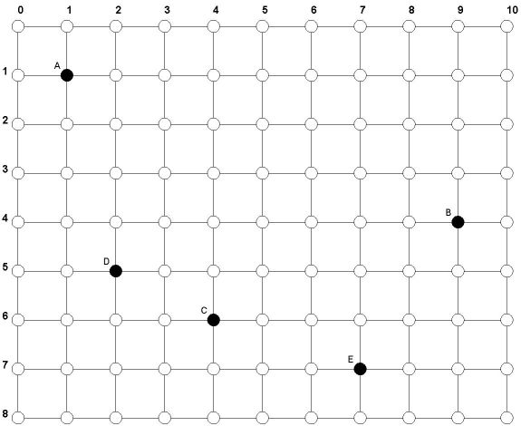

# Εύρεση βέλτιστης θέσης για λειτουργία καφέ σε ορθογώνιο πλέγμα
## Problem
Στο παρακάτω ορθογώνιο πλέγμα φαίνονται οι θέσεις των σπιτιών 5 φίλων (A, B, C, D, E) οι οποίοι πρόκειται να ανοίξουν ένα καφέ (coffee-shop, όχι το ρόφημα  ) σε κάποιο σημείο του πλέγματος. Όμως επιθυμούν το σημείο αυτό να είναι τέτοιο ώστε το άθροισμα των αποστάσεων Manhattan, σύμφωνα με τον ορισμό που δόθηκε στο παρόμοιο πρόβλημα εδώ, από τα σπίτια τους προς αυτό να είναι το ελάχιστο δυνατό. Πού θα πρέπει να λειτουργήσουν το καφέ;  

    
  
Πώς θα βρούμε λύση στο πρόβλημα για αυθαίρετο πλέγμα δεδομένων διαστάσεων, δεδομένο πλήθος φίλων και δεδομένες θέσεις των σπιτιών τους στο πλέγμα;
## Solution
Έστω ότι η βέλτιστη θέση για να λειτουργήσει το καφέ είναι η (X,Y). Δηλαδή η συνολική απόσταση Manhattan, έστω Dmin, του σημείου αυτού από τα N σπίτια των φίλων με συντεταγμένες (xi,yi), i από 1 έως N, είναι η ελάχιστη δυνατή. Αυτή η συνολική απόσταση αποτελείται από δύο σκέλη, τη συνολική οριζόντια απόσταση και τη συνολική κατακόρυφη απόσταση, έστω Dminx και Dminy, αντίστοιχα. Οπότε έχουμε:

Κώδικας:  
Dminx = |X-x1|+|X-x2|+...+|X-xN|  
Dminy = |Y-y1|+|Y-y2|+...+|Y-yN|  
Dmin = Dminx + Dminy  

Προφανώς, οι οριζόντιες μετακινήσεις είναι ανεξάρτητες από τις κατακόρυφες, οπότε αρκεί να ελαχιστοποιήσουμε ξεχωριστα τα Dminx και Dminy, οπότε θα έχει ελαχιστοποιηθεί και το Dmin. Δηλαδή, αρκεί να δουλέψουμε σε μία μόνο διάσταση, έστω την οριζόντια, και τα συμπεράσματα που θα καταλήξουμε θα μπορούμε να τα μεταφέρουμε και στην κατακόρυφη.

Έστω, λοιπόν, ότι έχουμε N σπίτια σε ευθεία (οριζόντια) γραμμή, στις θέσεις x1, x2, ..., xN. Πού είναι η βέλτιστη θέση για τη λειτουργία του καφέ;

Προφανώς, αν N=1, το καφέ πρέπει να λειτουργήσει στη θέση x1, αφού ο κάτοικος του μοναδικού σπιτιού θα έχει συνολική απόσταση 0 να διανύσει για να πάει στο καφέ.

Αν N=2, οποιαδήποτε θέση μεταξύ των x1 και x2 (έστω σε αύξουσα διάταξη), συμπεριλαμβανομένων και αυτών, είναι θέση ελάχιστης συνολικής απόστασης Manhattan, που προφανώς ισούται με x2-x1. Οποιαδήποτε θέση αριστερά από το x1 ή δεξιά από το x2, θα δώσει συνολική απόσταση Manhattan μεγαλύτερη από x2-x1.

Αν N=3, όπου τα σπίτια είναι στις θέσεις x1, x2 και x3 (έστω σε αύξουσα διάταξη), η βέλτιστη θέση για τη λειτουργία του καφέ είναι η x2. Η συνολική απόσταση Manhattan στην περίπτωση αυτή ισούται με x3-x1 και οποιαδήποτε άλλη θέση για το καφέ θα δώσει μεγαλύτερη συνολική απόσταση.

Αν N=4, με σπίτια στις θέσεις x1, x2, x3 και x4 (πάλι σε αύξουσα διάταξη), σκεπτόμενοι ομοίως μπορούμε να καταλήξουμε ότι οποιαδήποτε θέση στο διάστημα [x2,x3] είναι βέλτιστη.

Αν N=5, το μεσαίο σπίτι x3 είναι η βέλτιστη θέση.

Αν N=6, οποιαδήποτε θέση στο διάστημα [x3,x4] που ορίζεται από τα δύο μεσαία σπίτια είναι βέλτιστη.

Πού καταλήγουμε; Αν το N είναι περιττός, διατάσσοντας τις συντεταγμένες σε αύξουσα σειρά (ή φθίνουσα - δεν έχει σημασία), η "διαμεση" (median) συντεταγμένη είναι η βέλτιστη. Αν το N είναι άρτιος, υπάρχουν δύο "διάμεσες" συντεταγμένες, οπότε οποιαδήποτε θέση στο κλειστό διάστημα που ορίζεται από αυτές τις δύο είναι βέλτιστη.

Στο πρόβλημα του παραδείγματος, οι x συντατεγμένες των 5 (περιττός) σπιτιών είναι 1, 2, 4, 7, 9. Η διάμεση τιμή είναι η 4. Στον κατακόρυφο άξονα, οι συντεταγμένες είναι 1, 4, 5, 6, 7, με διάμεση τιμή την 5. Οπότε η βέλτιστη θέση για το καφέ είναι η (4,5).

Αν στο παραπάνω σχήμα είχαμε και άλλο ένα σπίτι F στην κάτω δεξιά γωνία, δηλαδή στη θέση (10,8), οπότε N=6 (άρτιος), οι x συντεταγμένες σε αύξουσα σειρά είναι οι 1, 2, 4, 7, 9, 10, οπότε οι δύο διάμεσες είναι οι 4 και 7 και οι y συντεταγμένες σε αύξουσα σειρα είναι οι 1, 4, 5, 6, 7, 8, οπότε οι διάμεσες είναι οι 5 και 6, άρα οποιαδήποτε θέση από τις (4,5), (5,5), (6,5), (7,5), (4,6), (5,6), (6,6), (7,6) αντιστοιχεί σε ελάχιστη συνολική απόσταση Manhattan.