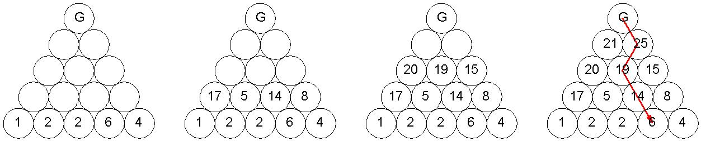
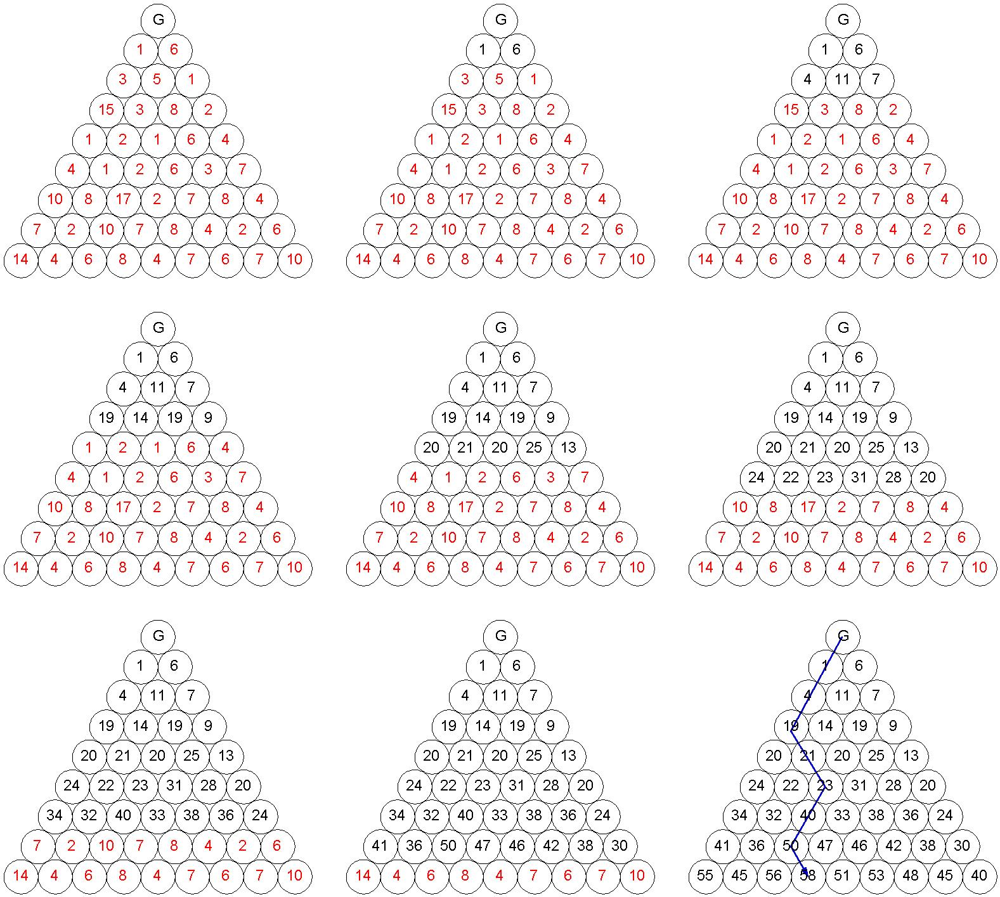

# Το πρόβλημα του χρυσοθήρα
## Problem
Έστω μία τριγωνική διάταξη από δίσκους, σε σχήμα ισοπλεύρου τριγώνου, όπου σε κάθε πλευρά του υπάρχουν Ν δίσκοι. Στο σχήμα αυτό:  

    
  
φαίνεται μία τέτοια διάταξη για Ν = 5. Στον δίσκο της επάνω κορυφής βρίσκεται ένας χρυσοθήρας (G). Σε κάθε άλλο δίσκο υπάρχει ένας αριθμός χρυσών νομισμάτων, το πλήθος των οποίων είναι δεδομένο, όπως φαίνεται στο παράδειγμα του σχήματος. Ο χρυσοθήρας μπορεί να κινηθεί από επάνω προς τα κάτω, επίπεδο-επίπεδο, και κάθε φορά μπορεί να κινηθεί στον δίσκο που είναι αμέσως δεξιά του ή αμέσως αριστερά του προς τα κάτω. Για παράδειγμα, από την αρχική του θέση ο χρυσοθήρας, μπορεί να πάει είτε σε αυτήν με το 1 νόμισμα, είτε σε αυτήν με τα 6 νομίσματα. Αν πάει σε αυτήν με το 1 νόμισμα, μετά μπορεί να πάει στην επόμενη με τα 3 νομίσματα ή στην άλλη με τα 5 νομίσματα, κοκ. Κάθε φορά που επισκέπτεται ο χρυσοθήρας ένα δίσκο, μαζεύει τα νομίσματα του δίσκου. Ποιο μονοπάτι πρέπει να ακολουθήσει για να μαζέψει τον μέγιστο αριθμό νομισμάτων; Να δοθεί αλγόριθμος (αρκεί να διατυπωθεί σε απλή φυσική γλώσσα) που να βρίσκει το βέλτιστο μονοπάτι.  

Ένα άλλο στιγμιότυπο δεδομένων του προβλήματος, για Ν = 9, είναι αυτό:  

 
## Solution 1
Όπως συζητήθηκε και στο μάθημα, η προφανής λύση είναι να διατρέξουμε όλα τα πιθανά μοναπάτια και να βρούμε ποιο αντιστοιχεί στο μέγιστο συνολικό αριθμό νομισμάτων (μέθοδος brute force). Η μέθοδος αυτή μπορεί να δουλέψει για μικρές εισόδους, αλλά όσο το N μεγαλώνει, τόσο πιο πολύ θα αργεί να βρεθεί η λύση.  

Όμως, προτάθηκαν και δύο πολύ πιο αποδοτικές μέθοδοι, που ουσιαστικά είναι ισοδύναμες, οι οποίες θα εξηγηθούν στη συνέχεια με τη βοήθεια των δύο παραδειγμάτων εισόδου που δόθηκαν. Υπενθυμίζεται ότι η πιο απλή είσοδος ήταν αυτή:  

  

Θα τροποποιήσουμε την τριγωνική αυτή διάταξη έτσι ώστε σε κάθε θέση να έχουμε, αντί για το πλήθος των νομισμάτων που βρίσκονται εκεί, το μέγιστο πλήθος των νομισμάτων που θα μπορούσε να μαζέψει ο χρυσοθήρας αν ξεκινούσε από τη θέση αυτή και κινούταν προς τα κάτω, όπως ορίζει η εκφώνηση του προβλήματος.  

Φανταστήτε ότι ο χρυσοθήρας αρχίζει τη διαδρομή του από κάποια θέση της τελευταίας γραμμής. Πόσα νομίσματα θα μπορεί να μαζέψει πηγαίνοντας προς τα κάτω, όπως ορίζει το πρόβλημα; Προφανώς, μόνο όσα βρίσκονται στη συγκεκριμένη θέση. Άρα, δεν θα πειράξουμε τους αριθμούς της τελευταίας γραμμής.  

Αν όμως ο χρυσοθήρας ξεκινήσει τη διαδρομή του από την προτελευταία γραμμή, ποιος είναι ο μέγιστος αριθμός νομισμάτων που μπορεί να μαζέψει; Όσα βρίσκονται στη θέση από την οποία ξεκινά συν τα νομίσματα που βρίσκονται σε μία από τις δύο θέσεις της τελευταίας γραμμής, αμέσως αριστερά ή αμέσω δεξιά, όποιος από τους δύο αριθμούς είναι μεγαλύτερος. Δηλαδή αν ο χρυσοθήρας ξεκινούσε από το 15 της προτελευταίας γραμμής, μετά προφανώς θα προτιμούσε να πάει στο 2 και όχι στο 1 της τελευταίας. Άρα, αν ξεκινήσει από το 15, τελικά μπορεί να μαζέψει 17 νομίσματα, οπότε αλλάζουμε το 15 σε 17. Αν ξεκινούσε από το 3 της προτελευταίας γραμμής, τελικά θα μπορούσε να μαζέψει 5 νομίσματα (δεν έχει σημασία αν από εκεί θα πάει αριστερά ή δεξιά, αφού και οι δύο προσβάσιμες θέσεις της τελευταίας γραμμής έχουν 2 νομίσματα). Άρα αλλάζουμε το 3 σε 5. Από το 8 της προτελευταίας γραμμής θα μπορεί να μαζέψει 14 ( = 8 + max(2,6)) και από το 2 θα μπορούσε να μαζέψει 8 (= 2 + 6). Οπότε η προτελευταία γαμμή γίνεται: 17 5 14 8. Συνεχίζουμε με αυτόν τον τρόπο, γραμμή-γραμμή προς τα επάνω, μέχρι να φτάσουμε στην κορυφή.  

Τα δεδομένα μας σταδιακά έχουν τρ0ποποιηθεί όπως φαίνεται στο εξής σχήμα:  

  

Πώς βρίσκουμε τώρα το βέλτιστο μονοπάτι; Αρκεί ο χρυσοθήρας να επιλέγει κάθε φορά την κίνηση εκείνη (αριστερά ή δεξιά) που τον οδηγεί σε μεγαλύτερο αριθμό, εννοείται στη διάταξη με τους τροποποιημένους αριθμούς, που είναι το μέγιστο πλήθος νομισμάτων που μπορεί να μαζέψει ο χρυσοθήρας από εκείνη τη θέση και κάτω.  

Ένας εναλλακτικός, αλλά επί της ουσίας ίδιος, αλγόριθμος είναι να δουλέψουμε όχι από κάτω προς τα επάνω, αλλά από επάνω προς τα κάτω. Πάλι θα τροποποιήουμε τα δεδομένα μας, αλλά με λίγο διαφορετικό τρόπο. Κάθε θέση θα περιέχει πλέον το μέγιστο πλήθος νομισμάτων που θα μπορούσε να μαζέψει ο χρυσοθήρας, αν σταματούσε το ταξίδι του σε αυτή τη θέση. Ας δούμε πώς δουλεύει αυτή η μέθοδος στο μεγάλο παράδειγμα εισόδου που είχαμε.  

  

Προφανώς, αν ο χρυσοθήρας σταματήσει στην πρώτη γραμμή κάτω από αυτόν, θα έχει μαζέψει ή 1 ή 6 νομίσματα, ανάλογα με την κίνηση που θα κάνει. Οπότε, η γραμμή αυτή δεν τροποποιείται. Αν σταματήσει στη δεύτερη γραμμή κάτω από αυτόν, τι γίνεται; Αν καταλήξει στο 3, πόσα νομίσματα θα έχει μαζέψει; Προφανώς 4 (= 3 + 1), αφού στο 3 μπορεί να πάει μόνο από το 1 της προηγούμενης γραμμής. Οπότε, θα αλλάξουμε το 3 σε 4. Αν καταλήξει όμως στο 5, ποιος θα ήταν ο μέγιστος αριθμός νομισμάτων που θα μπορούσε να είχε μαζέψει; Θα ήταν 11 (= 5 + 6), γιατί προφανώς τον συμφέρει να πάει στο 5 από το 6 της από πάνω γραμμής και όχι από το 1. Οπότε, θα αλλάξουμε το 5 σε 11. Τέλος, το 1 θα αλλάξει σε 7 (= 1 + 6). Άρα η δεύτερη γραμμή κάτω από τον χρυσοθήρα θα γίνει: 4 11 7.

Συνεχίζουμε με αυτόν τον τρόπο προς τα κάτω, μέχρι να φτάσουμε στην τελευταία γραμμή. Δείτε πώς εξελίσσεται σταδιακά η διάταξη με τους αριθμούς. Στο τέλος, κάθε θέση περιέχει τον μέγιστο αριθμό νομισμάτων που μπορεί να μαζέψει ο χρυσοθήρας αν ξεκινήσει από την αρχή και καταλήξει σε αυτή τη θέση. Συγκρίνετέ το με την παραλλαγή που δείξαμε για τη μικρή είσοδο, όπου κάθε θέση περιέχει τον μέγιστο αριθμό νομισμάτων που μπορεί να μαζέψει ο χρυσοθήρας αν ξεκινήσει από αυτή τη θέση και καταλήξει στην τελευταία γραμμή.  

  

Οπότε, τώρα πώς θα βρούμε το βέλτιστο μονοπάτι; Ξεκινάμε από τον μέγιστο αριθμό της τελευταίας γραμμής και ανεβαίνουμε προς τα επάνω επιλέγοντας κάθε φορά εκείνη την κίνηση που μας οδηγεί σε μέγιστο αριθμό. 