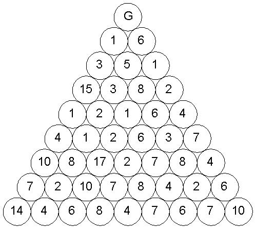

# Το πρόβλημα του χρυσοθήρα
## Problem
Έστω μία τριγωνική διάταξη από δίσκους, σε σχήμα ισοπλεύρου τριγώνου, όπου σε κάθε πλευρά του υπάρχουν Ν δίσκοι. Στο σχήμα αυτό:  

    
  
φαίνεται μία τέτοια διάταξη για Ν = 5. Στον δίσκο της επάνω κορυφής βρίσκεται ένας χρυσοθήρας (G). Σε κάθε άλλο δίσκο υπάρχει ένας αριθμός χρυσών νομισμάτων, το πλήθος των οποίων είναι δεδομένο, όπως φαίνεται στο παράδειγμα του σχήματος. Ο χρυσοθήρας μπορεί να κινηθεί από επάνω προς τα κάτω, επίπεδο-επίπεδο, και κάθε φορά μπορεί να κινηθεί στον δίσκο που είναι αμέσως δεξιά του ή αμέσως αριστερά του προς τα κάτω. Για παράδειγμα, από την αρχική του θέση ο χρυσοθήρας, μπορεί να πάει είτε σε αυτήν με το 1 νόμισμα, είτε σε αυτήν με τα 6 νομίσματα. Αν πάει σε αυτήν με το 1 νόμισμα, μετά μπορεί να πάει στην επόμενη με τα 3 νομίσματα ή στην άλλη με τα 5 νομίσματα, κοκ. Κάθε φορά που επισκέπτεται ο χρυσοθήρας ένα δίσκο, μαζεύει τα νομίσματα του δίσκου. Ποιο μονοπάτι πρέπει να ακολουθήσει για να μαζέψει τον μέγιστο αριθμό νομισμάτων; Να δοθεί αλγόριθμος (αρκεί να διατυπωθεί σε απλή φυσική γλώσσα) που να βρίσκει το βέλτιστο μονοπάτι.  

Ένα άλλο στιγμιότυπο δεδομένων του προβλήματος, για Ν = 9, είναι αυτό:  

 
## Solution 1
Για να βρούμε το πλήθος των δυνατών μονοπατιών ελάχιστης απόστασης, σκεφτόμαστε ως εξής (δείτε σχήμα παρακάτω). Έστω P(i,j) το πλήθος των μονοπατιών από το σημείο Α στη θέση που βρίσκεται στη στήλη i και στη γραμμή j. Για να μεταβούμε στη θέση (i,j), πρέπει πριν είτε να βρισκόμαστε στη θέση (i-1,j) και να κάνουμε μία κίνηση προς τα δεξιά, είτε να βρισκόμαστε στη θέση (i,j-1) και να κάνουμε μία κίνηση προς τα κάτω. Το πλήθος των μονοπατιών για την πρώτη περίπτωση ισούται με P(i-1,j) και για τη δεύτερη p(i,j-1). Το άθροισμα αυτών πρέπει να ισούται, προφανώς, με P(i,j). Άρα:
P(i,j) = P(i-1,j) + P(i,j-1)

Για όλες τις θέσεις της πρώτης γραμμής και της πρώτης στήλης, το πλήθος των μονοπατιών ελάχιστης απόστασης από το Α σε κάποια από αυτές είναι 1. Δηλαδή:
P(i,0) = 1, για κάθε i
P(0,j) = 1, για κάθε j

Με βάση τους παραπάνω τύπους, μπορούμε να υπολογίσουμε όλα τα P(i,j) κατά γραμμές, οπότε τελικά καταλήγουμε ότι το ζητούμενο πλήθος μονοπατιών ελάχιστης απόστασης από το Α στο Β είναι 792.  
  
  
## Solution 2
Υπάρχει και ένας εναλλακτικός τρόπος επίλυσης του παραπάνω προβλήματος. Αν θέλουμε να πάμε από το Α στο Β με την ελάχιστη απόσταση, πρέπει να κάνουμε 7 μετακινήσεις προς τα δεξιά (Δ) και 5 προς τα κάτω (Κ), συνολικά 12. Οι μετακινήσεις αυτές μπορούν να γίνουν με οποιαδήποτε σειρά. Για παράδειγμα, ένα μονοπάτι είναι το
Δ-Δ-Δ-Δ-Δ-Δ-Δ-Κ-Κ-Κ-Κ-Κ
δηλαδή, μετακίνηση στον τελικό στόχο μέσω της θέσης επάνω δεξιά, δηλαδή της (7,0).

Άλλο μονοπάτι είναι το
Κ-Κ-Κ-Κ-Κ-Δ-Δ-Δ-Δ-Δ-Δ-Δ
δηλαδή, μετακίνηση μέσω της θέσης κάτω αριστερά, της (0,5).

Ή το
Δ-Δ-Κ-Δ-Κ-Κ-Δ-Δ-Κ-Δ-Κ-Δ
που είναι μία νόμιμη ζιγκ-ζαγκ μετακίνηση.

Πόσα είναι όλα αυτά τα μονοπάτια; Αρκεί να βρούμε με πόσους τρόπους στα 12 βήματα θα κάνουμε 7 δεξιές μετακινήσεις, δηλαδή σε ποια βήματα θα γίνουν αυτές οι δεξιές μετακινήσεις. Προφανώς, οι υπόλοιπες μετακινήσεις θα είναι προς τα κάτω. Το πλήθος αυτό ισούται με τους συνδυασμούς 12 αντικειμένων ανά 7 (ή 12 ανά 5), δηλαδή 12!/(7! x 5!) = 479001600 / (5040 x 120) = 792. Στη γενική περίπτωση, που το πλέγμα έχει διαστάσεις N x M, το πλήθος των τρόπων ισούται με (N + M)!/(N! x M!).