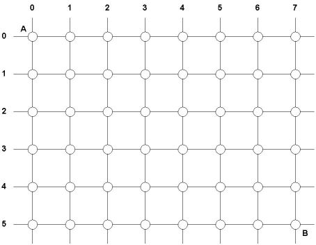
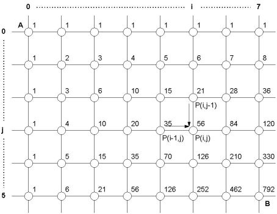

# The grid problem
## Problem
Έστω το ορθογώνιο πλέγμα του παρακάτω σχήματος:\n
\n
Θέλουμε να μετακινηθούμε από το σημείο Α προς το σημείο Β διανύοντας την ελάχιστη δυνατή απόσταση, η οποία ονομάζεται "απόσταση Manhattan", από το Manhattan στη Νέα Υόρκη, που έχει, ως επί το πλείστον, ορθογώνια ρυμοτομία. Αυτό μπορεί να γίνει με διάφορους τρόπους, αρκεί να κινούμαστε πάντα προς τα δεξιά ή προς τα κάτω. Όλοι αυτοί οι τρόποι αντιστοιχούν στην ίδια συνολική απόσταση μετακίνησης, την απόσταση Manhattan. Πόσοι είναι οι τρόποι για να το κάνουμε αυτό στο συγκεκριμένο στιγμιότυπο του προβλήματος; Πώς μπορούμε να βρούμε την απάντηση για οποιοδήποτε πλέγμα δεδομένων διαστάσεων;
## Solution
Για να βρούμε το πλήθος των δυνατών μονοπατιών ελάχιστης απόστασης, σκεφτόμαστε ως εξής (δείτε σχήμα παρακάτω). Έστω P(i,j) το πλήθος των μονοπατιών από το σημείο Α στη θέση που βρίσκεται στη στήλη i και στη γραμμή j. Για να μεταβούμε στη θέση (i,j), πρέπει πριν είτε να βρισκόμαστε στη θέση (i-1,j) και να κάνουμε μία κίνηση προς τα δεξιά, είτε να βρισκόμαστε στη θέση (i,j-1) και να κάνουμε μία κίνηση προς τα κάτω. Το πλήθος των μονοπατιών για την πρώτη περίπτωση ισούται με P(i-1,j) και για τη δεύτερη p(i,j-1). Το άθροισμα αυτών πρέπει να ισούται, προφανώς, με P(i,j). Άρα:
P(i,j) = P(i-1,j) + P(i,j-1)

Για όλες τις θέσεις της πρώτης γραμμής και της πρώτης στήλης, το πλήθος των μονοπατιών ελάχιστης απόστασης από το Α σε κάποια από αυτές είναι 1. Δηλαδή:
P(i,0) = 1, για κάθε i
P(0,j) = 1, για κάθε j

Με βάση τους παραπάνω τύπους, μπορούμε να υπολογίσουμε όλα τα P(i,j) κατά γραμμές, οπότε τελικά καταλήγουμε ότι το ζητούμενο πλήθος μονοπατιών ελάχιστης απόστασης από το Α στο Β είναι 792.

Υπάρχει και ένας εναλλακτικός τρόπος επίλυσης του παραπάνω προβλήματος. Αν θέλουμε να πάμε από το Α στο Β με την ελάχιστη απόσταση, πρέπει να κάνουμε 7 μετακινήσεις προς τα δεξιά (Δ) και 5 προς τα κάτω (Κ), συνολικά 12. Οι μετακινήσεις αυτές μπορούν να γίνουν με οποιαδήποτε σειρά. Για παράδειγμα, ένα μονοπάτι είναι το
Δ-Δ-Δ-Δ-Δ-Δ-Δ-Κ-Κ-Κ-Κ-Κ
δηλαδή, μετακίνηση στον τελικό στόχο μέσω της θέσης επάνω δεξιά, δηλαδή της (7,0).

Άλλο μονοπάτι είναι το
Κ-Κ-Κ-Κ-Κ-Δ-Δ-Δ-Δ-Δ-Δ-Δ
δηλαδή, μετακίνηση μέσω της θέσης κάτω αριστερά, της (0,5).

Ή το
Δ-Δ-Κ-Δ-Κ-Κ-Δ-Δ-Κ-Δ-Κ-Δ
που είναι μία νόμιμη ζιγκ-ζαγκ μετακίνηση.

Πόσα είναι όλα αυτά τα μονοπάτια; Αρκεί να βρούμε με πόσους τρόπους στα 12 βήματα θα κάνουμε 7 δεξιές μετακινήσεις, δηλαδή σε ποια βήματα θα γίνουν αυτές οι δεξιές μετακινήσεις. Προφανώς, οι υπόλοιπες μετακινήσεις θα είναι προς τα κάτω. Το πλήθος αυτό ισούται με τους συνδυασμούς 12 αντικειμένων ανά 7 (ή 12 ανά 5), δηλαδή 12!/(7! x 5!) = 479001600 / (5040 x 120) = 792. Στη γενική περίπτωση, που το πλέγμα έχει διαστάσεις N x M, το πλήθος των τρόπων ισούται με (N + M)!/(N! x M!).